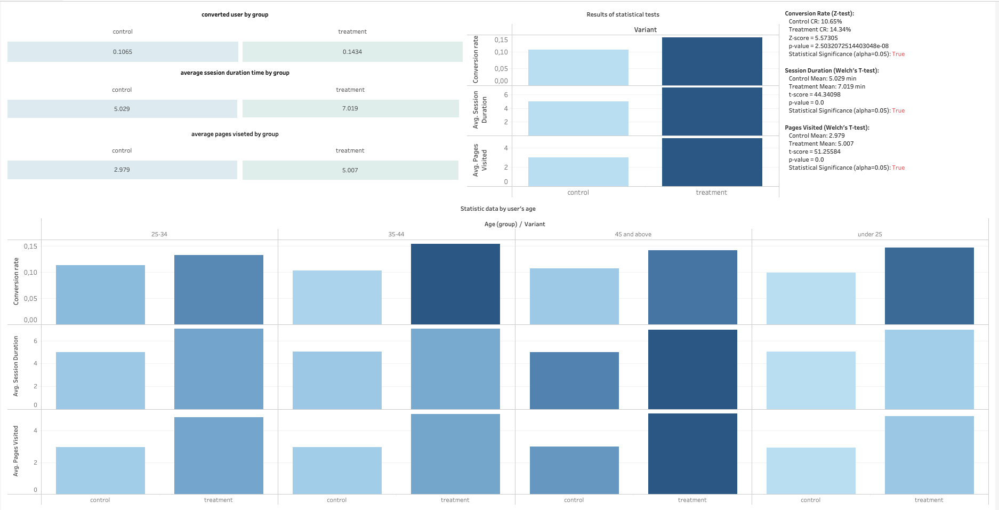

# A/B Testing Analysis: E-commerce Product Feature Evaluation

## 📌 Project Overview
This project focuses on evaluating the results of an A/B test for a new e-commerce product feature. The goal is to determine whether the new feature (Treatment group) delivers a statistically significant improvement over the current version (Control group) across key product metrics: Conversion Rate, Session Duration, and Pages Visited.

The analysis is conducted using a robust data pipeline: **SQL** for data aggregation and segmentation, **Python** for statistical hypothesis testing, and **Tableau** for interactive executive dashboards.

---

## 📊 Dataset Description
The analysis is based on the `ab_test_results.csv` dataset, which includes the following user metrics:
*   `user_id`: Unique identifier for each user.
*   `variant`: The test group assignment (`control` or `treatment`).
*   `converted`: Binary indicator of user conversion (`0` = no, `1` = yes).
*   `session_duration`: Total time spent by the user per session (in minutes).
*   `pages_visited`: Number of pages viewed during the session.
*   `age`: User's age.

---

## 🛠️ Tech Stack & Methodology

### 1. Data Aggregation & Segmentation (SQL)
SQL was utilized to perform initial data exploration, calculate baseline metrics per group, and segment user engagement by age brackets (`<25`, `25-34`, `35-44`, `45+`).
*   *File:* [`ab_test_queries.sql`](./ab_test_queries.sql)

### 2. Statistical Hypothesis Testing (Python)
To validate if the observed differences between the groups were statistically significant (at $\alpha = 0.05$), Python was used to run appropriate statistical tests:
*   **Proportions Z-test:** To evaluate the changes in binary `converted` user counts.
*   **Welch's T-test:** To compare continuous metrics (`session_duration` and `pages_visited`) without assuming equal variances between groups.
*   *File:* [`ab_test_statistical_analysis.ipynb`](./ab_test_statistical_analysis.ipynb)

### 3. Data Visualization (Tableau)
An interactive dashboard built in Tableau provides a deep dive into metric performance across different age groups (Small Multiples matrix chart).
*   *Interactive Dashboard:* [View on Tableau Public]([
<noscript></noscript><object class='tableauViz'  style='display:none;'><param name='host_url' value='https%3A%2F%2Fpublic.tableau.com%2F' /> <param name='embed_code_version' value='3' /> <param name='site_root' value='' /><param name='name' value='abtestanalyse&#47;Resultsofstatisticaltests' /><param name='tabs' value='yes' /><param name='toolbar' value='yes' /><param name='static_image' value='https:&#47;&#47;public.tableau.com&#47;static&#47;images&#47;ab&#47;abtestanalyse&#47;Resultsofstatisticaltests&#47;1.png' /> <param name='animate_transition' value='yes' /><param name='display_static_image' value='yes' /><param name='display_spinner' value='yes' /><param name='display_overlay' value='yes' /><param name='display_count' value='yes' /><param name='language' value='en-US' /><param name='filter' value='publish=yes' /></object>
                ](https://public.tableau.com/views/abtestanalyse/Resultsofstatisticaltests?:language=en-US&publish=yes&:sid=&:redirect=auth&:display_count=n&:origin=viz_share_link))

---

## 🚀 Key Findings & Insights
*(Note: Update these findings based on the exact outputs of your code)*
*   **Conversion Rate:** The Treatment group showed a statistically significant increase in conversion rate ($p < 0.05$).
*   **User Engagement:** Both average session duration and pages visited demonstrated solid growth in the treatment variant.
*   **Age Heterogeneity:** Segmented analysis reveals that the new feature performed consistently well across all age groups, with the highest engagement lift observed in the `25-34` cohort.

## 💡 Recommendation
Based on the statistical significance of the Primary KPI (Conversion Rate) and positive directional shifts in Guardrail engagement metrics, **it is recommended to roll out the Treatment feature to 100% of the user base.**
